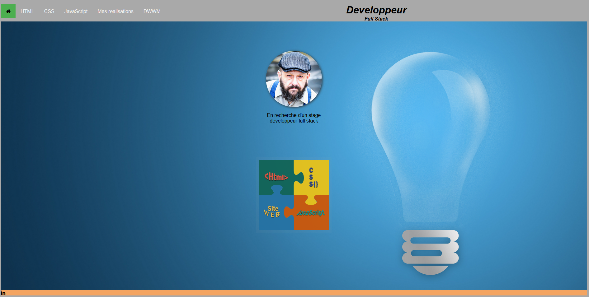

# Réalisation d'un portfolio destiné à mette en pratique et réviser son HTML, CSS et ajouter des fonctions JavaScript pour rendre le site plus dynamique
    le premier jet du travail ne prend pas en compte (très peu) de Js, mais plutôt un travail de révision HTML, CSS
    le site n'est pas figé mais en perpétuel modification au fur et à mesure de l'avancement de la formation
# Portfolio François POULLOT Dév Full Stack en devenir

**Langages :**

    -HTML
    -CSS

    -JAVASCRIPT (*ici le JavaScript du menu hamburger même si je sais le décoder, je l'ai récupérer).